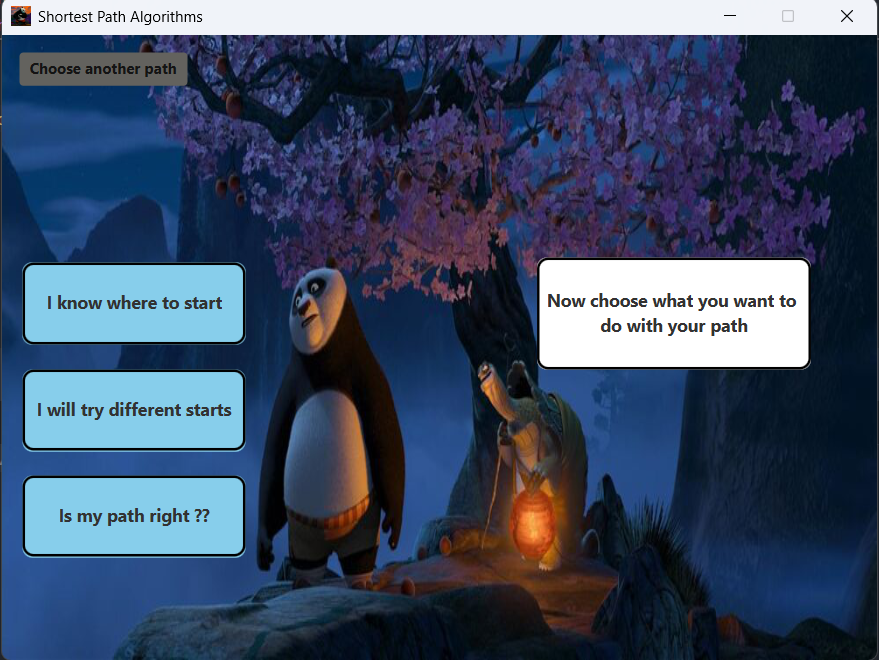
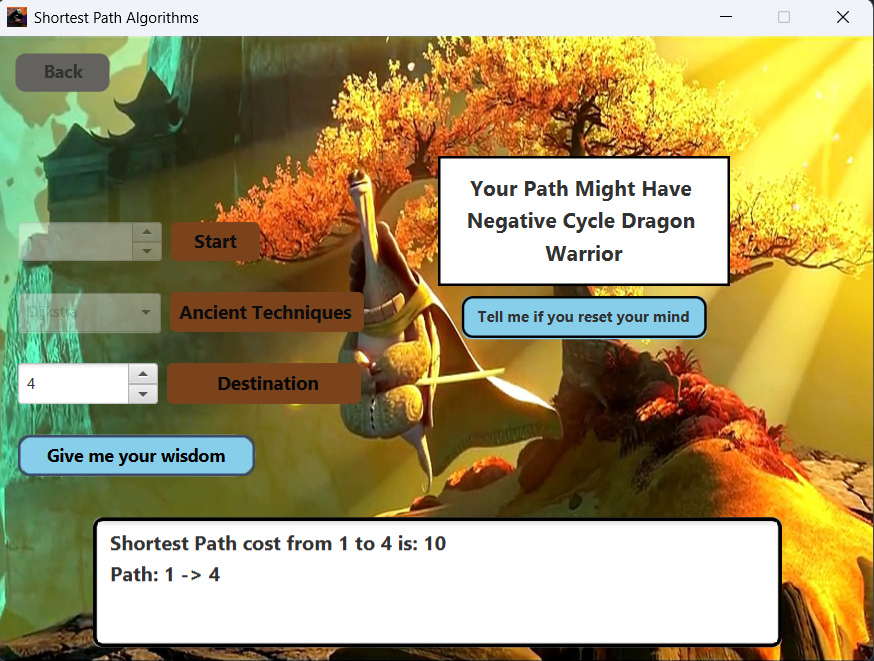
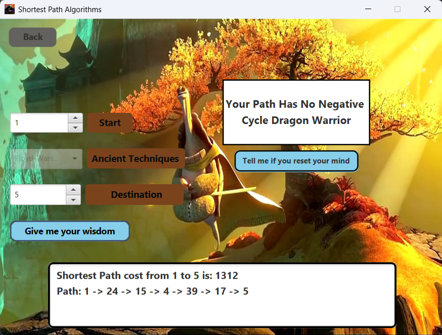
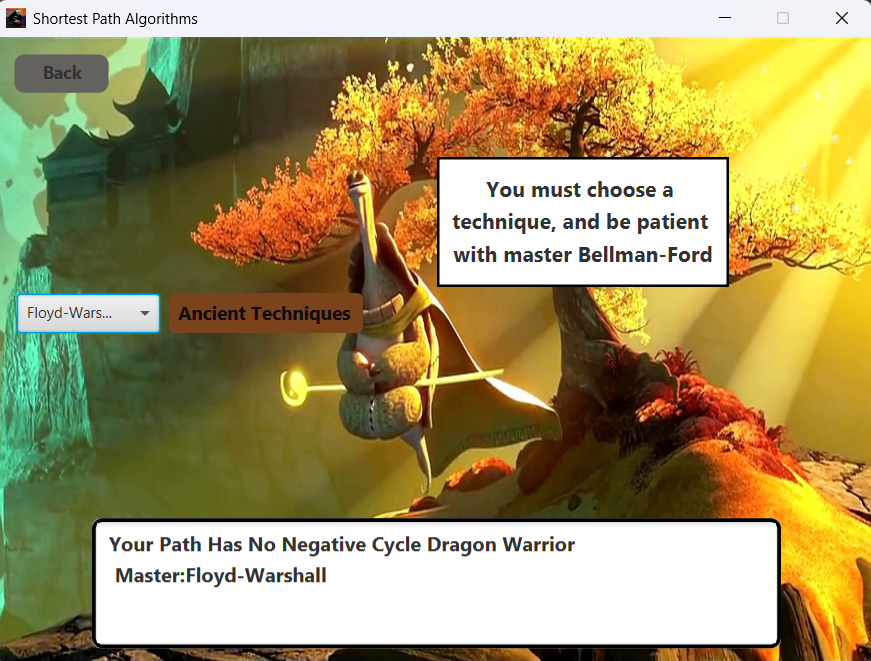

# Finding your Path
This project implements some of the famous graph algorithms for finding shortest path in funny matter that is related to famous cartoon Kung-Fu panda and how at the end Pu (Main character) follows some Algorithms to reach his goal.

## Implemented Algorithms
1. Dijkstra Algorithm
2. Bellman-Ford Algorithm
3. Floyd-Warshall Algorithm

## Screenshots

